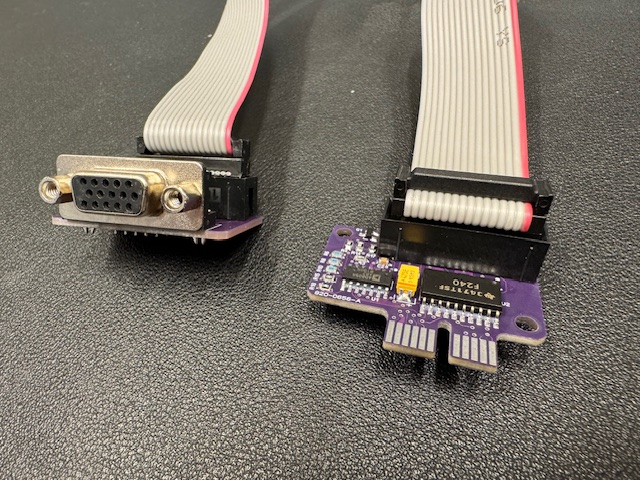

# Apple External Video Connector M4099LL/B

This is a tested and working analog board recreation of the Apple External Video Connector M4099LL/B.
This is the connector board enables many older all-in-one Macintosh computers to provide video output. 
This board is for video mirroring, it does not render independent output.

## General

The External Video board can be used on:

- LC580
- Performa 5200
- Performa 5300
- Performa 5400
- Performa 5500
- TAM *(This accessory was not officially supported on TAM. It installs easily, but there isn't a space for the port.)*

## Improvements

* Replaced EOL parts for modern replacements.

## JLC

This 4-layer board can be produced using JLCPCB using 1.6MM thickness. ENIG finish is recommended.
You need to choose what kind of connector you want to end with: VGA or DB15. The VGA/DB15 connectorboard and the card are connected to each other by using a 2x8P straight ribbon cable.

|  |  |
| ---------------------------------------------- | --------------------------------------------------- |

## BOM

| C1   | 50pF      | 0805   | Bottom |
| ---- | --------- | ------ | ------ |
| C3   | 4.7uF/25V | D-Case | Bottom |
| C5   | 100nF     | 0805   | Bottom |
| C6   | 100nF     | 0805   | Bottom |
| C7   | 50pF      | 0805   | Bottom |
| C8   | 100nF     | 0805   | Bottom |
| C9   | 50pF      | 0805   | Bottom |
| C10  | 50pF      | 0805   | Bottom |
| C12  | 50pF      | 0805   | Bottom |
| C14  | 50pF      | 0805   | Bottom |
| Q2   | 2N3904    | SOT23  | Bottom |
| Q3   | 2N3904    | SOT23  | Bottom |
| Q4   | 2N3904    | SOT23  | Bottom |
| R12  | 1K        | 0805   | Bottom |
| R13  | 360 Ohm   | 0805   | Bottom |
| R19  | 1K        | 0805   | Bottom |
| R20  | 75 Ohm    | 0805   | Bottom |
| R23  | 75 Ohm    | 0805   | Bottom |
| R24  | 75 Ohm    | 0805   | Bottom |
| R25  | 75 Ohm    | 0805   | Bottom |
| R26  | 1K        | 0805   | Bottom |
| R27  | 75 Ohm    | 0805   | Bottom |
| R32  | 75 Ohm    | 0805   | Bottom |
| R38  | 0 Ohm     | 0805   | Bottom |
| R41  | 360 Ohm   | 0805   | Bottom |
| R42  | 360 Ohm   | 0805   | Bottom |
| R43  | 360 Ohm   | 0805   | Bottom |
| R44  | 360 Ohm   | 0805   | Bottom |
| R45  | 360 Ohm   | 0805   | Bottom |
| R48  | 360 Ohm   | 0805   | Bottom |
| C2   | 100nF     | 0805   | Top    |
| C4   | 4.7uF/25V | D-Case | Top    |
| Q1   | MMNT3906  | SOT23  | Top    |
| R3   | 910 Ohm   | 0805   | Top    |
| R4   | 1K        | 0805   | Top    |
| R6   | 360 Ohm   | 0805   | Top    |
| R8   | 360 Ohm   | 0805   | Top    |
| R10  | 360 Ohm   | 0805   | Top    |
| R14  | 1K        | 0805   | Top    |
| R15  | 1K        | 0805   | Top    |
| R17  | 1K        | 0805   | Top    |
| R18  | 1K        | 0805   | Top    |
| U1   | AD8054ARZ | ---    | Top    |
| U2   | 74F240    | ---    | Top    |

## License

The provided logicboard files are licensed under CC-BY-NC-SA - they are NOT intended for commercial use.

## Disclaimer

This project involves potentially lethal High-Voltage. Construction and operation of this circuit should only be performed by people familiar with best practices when operating with high voltage, and using extreme caution.
I will not be held liable for injury or even death resulting from this part. Build and use this part only at your own risk.